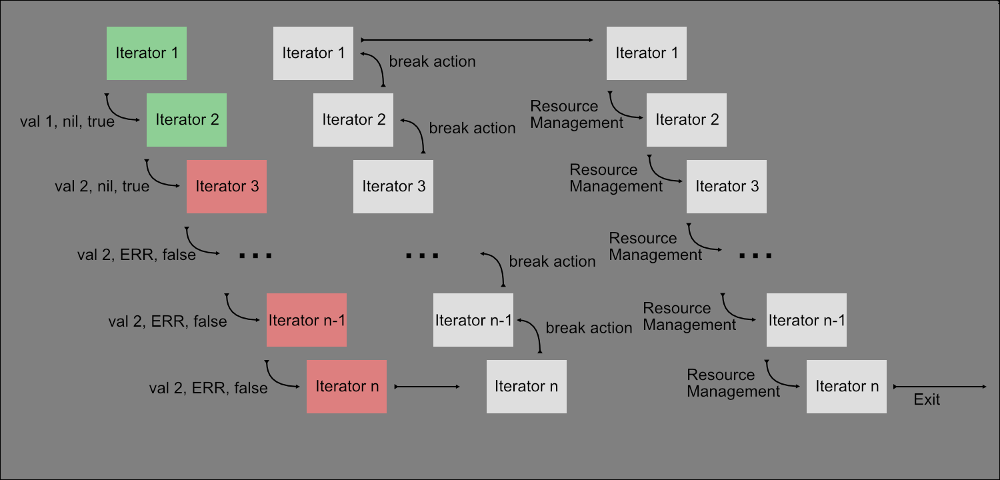

# iter

A generic lazy iterator framework package that respects errors as values with
reverse message passing for resource management.

https://github.com/barbell-math/util/blob/f6e85def6c5fa2ccd75b15c691c31e9b3a298e1d/src/iter/example_test.go#L28-L39
```
//Example Output:
//Area is 1000.000000 Using step size: 0.000100
//Err is: <nil>
```

## Design

This package takes advantage of the fact that functions can have methods in go.
This allows an iterator to be defined as a simple function, as shown below.

https://github.com/barbell-math/util/blob/f6e85def6c5fa2ccd75b15c691c31e9b3a298e1d/src/iter/Common.go#L14-L22
<sup>The iter type defined in this package.</sup>

Given this iterator type, it can have methods attached to it that can call on
their relative 'object' (which would be a function in this case) to get values
as needed. Each method then returns a new iterator, allowing the method calls to
be chained together. The end result of this is a recursive, lazily evaluated
iterator sequence.

There are three parts to any iterator chain, with the middle part being
optional:

1. Producer: The producer is responsible for creating a sequence of values to
pass to the rest of the iterators. The source can be a slice, channel, or a
single value.
1. Intermediary: An Intermediary is responsible for taking it's parent iterators
values, mutating and/or filtering them, and passing them down to it's child
iterator.
1. Consumer: The consumer is what collects all of the final values and either
saves them or performs some other aggregate function with them.

### Producers

Producers can be any function that returns an iterator. They are responsible for
producing the sequence of values that the rest of the iterator chain consumes.
There are several rules that a consumer must obey:

1. Errors are returned from the producer. 
1. When an error is returned the value of the iterator element that is returned
does not have to be valid.
1. When an error is returned the continue flag must be set to false.
1. A producer will only perform resource management when it receives the
[break action](#reverse-message-passing), not when it returns the initial error.

### Intermediaries

Intermediaries sit between producers and consumers. They consume the values from
a parent iterator and (potentially) pass that value to the consumer after 
(potentially) applying some transformation to the value. There are several rules
that an intermediary must obey:

1. Errors are propagated down to the consumer.
1. When an error is returned the continue flag must be set to false.
1. All [break actions](#reverse-message-passing) will be passed up to the
producer. This allows resources to be destroyed in a top down fashion.
1. If an intermediary produces a continue flag that tells the next iterator to
stop, it should not clean up its parents or itself, but should simply return the
flag to not continue. The consumer will start the destruction process once it
sees the command to not continue.

> Tip:
> `Next` is a very ubiquitous intermediary, most other intermediaries can be
> expressed using `Next` making them pseudo-intermediaries. By using this
> pattern all pseudo-intermediaries are abstracted away from the complex looping
> logic outlined above and do not need to worry about iterator feedback and
> message passing.

### Consumers

Consumers are the final stage in a iterator sequence. Without a consumer a
iterator chain will not be consumed due to the iterator chain being lazily
evaluated. There are several rules that a consumer must obey:

1. When an error is generated no further values should be consumed and the
[break action](#reverse-message-passing) should be passed to the consumers
parent iterator.
1. When all elements have been consumed iteration should stop and the
[break action](#reverse-message-passing) should be passed to the consumers
parent iterator.
1. All errors generated from a consumers parent iterator chain should be
returned to the calling code.

> Tip:
> `ForEach` is a very ubiquitous consumer. Most other consumers can be
represented using `ForEach`, making them pseudo-consumers. By using this
> pattern all pseudo-consumers are abstracted away from the complex looping
> logic outlined above and do not need to worry about iterator feedback and
> message passing.

## Reverse Message Passing

Each iterator chooses one of three actions to attach to the current value in the
iterator sequence. These values are managed for each individual iterator, and
are passed between the child and parent iterators.

1. Continue: Signaling to 'accept' the current value and pass it along to the
child iterator.
1. Break: Signaling to ignore the current value and return the signal to stop
iterating.
1. Iterate: Signaling the current iterator to continue iterating and pull the
next value in the iterator sequence.

Any iterator can produce an error or signal its child iterator to stop
iterating. When this happens, the command to stop iterating must be passed all
the way down to the consumer with no action being taken by any of the
intermediaries. Recognizing that iteration should stop, the consumer must then
call its parent iterator with the `Break` action. This action must be propagated
all the way up to the producer without any intermediaries performing any action.
Upon receiving this value the producer should perform it's resource management.
Once done, the producer should return any errors and it's child iterator should
then perform resource management. Each successive intermediary will then perform
it's resource management once it's parent iterator is done until the consumer is
reached. This allows for resources to be properly destroyed in a top-down
fashion. This pattern of events is demonstrated in the image below.



## Sudo Iterators

The intermediaries and consumers can be further sub-categorized:

1. Pseudo: Any iterator that is expressed using another iterator. For
intermediaries a it is common to use `Next` and for consumers it is common to
use `ForEach`.

https://github.com/barbell-math/util/blob/f6e85def6c5fa2ccd75b15c691c31e9b3a298e1d/src/iter/PseudoConsumer.go#L65-L77
<sup>Example pseudo-consumer</sup>

https://github.com/barbell-math/util/blob/f6e85def6c5fa2ccd75b15c691c31e9b3a298e1d/src/iter/PseudoIntermediary.go#L21-L36
<sup>Example pseudo-intermediary</sup>

2. Non-Pseudo: Any iterator that is not expressed using another iterator. For
examples refer to the `ForEach` and `Next` functions.

> Tip:
> If you are looking to extend this package and add more iterators, it is
> recommended that any new intermediary or consumer iterators are created
> _using the non-pseudo iterators_. This will reduce errors and time spent
> needlessly banging your head against a wall.

## Benchmarking

Obviously, there will be overhead when using this package instead of using plain
for loops. The `example_test.go` file not only showcases the example at the top
of this readme, but contains benchmarks for three different scenarios. These
scenarios are shown below for convenience.

##### Scenario 1: An over the top implementation using iterators

https://github.com/barbell-math/util/blob/f6e85def6c5fa2ccd75b15c691c31e9b3a298e1d/src/iter/example_test.go#L28-L38

##### Scenario 2: Another implementation using iterators

https://github.com/barbell-math/util/blob/f6e85def6c5fa2ccd75b15c691c31e9b3a298e1d/src/iter/example_test.go#L53-L59

##### Scenario 3: A basic for loop

https://github.com/barbell-math/util/blob/f6e85def6c5fa2ccd75b15c691c31e9b3a298e1d/src/iter/example_test.go#L74-77

The benchmarks (gathered from the go benchmark utility) for the scenarios with
various step sizes are shown below. Make of these results as you will.

| Scenario | Step Size | Time           |
|----------|-----------|----------------|
| 1        | 1         | 7815 ns/op     |
| 2        | 1         | 5930 ns/op     |
| 3        | 1         | 3706 ns/op     |
| 1        | 0.1       | 84634 ns/op    |
| 2        | 0.1       | 59650 ns/op    |
| 3        | 0.1       | 34406 ns/op    |
| 1        | 0.01      | 765754 ns/op   |
| 2        | 0.01      | 576928 ns/op   |
| 3        | 0.01      | 352233 ns/op   |
| 1        | 0.001     | 7526192 ns/op  |
| 2        | 0.001     | 5810898 ns/op  |
| 3        | 0.001     | 3460169 ns/op  |
| 1        | 0.0001    | 73463321 ns/op |
| 2        | 0.0001    | 57991047 ns/op |
| 3        | 0.0001    | 34179406 ns/op |
